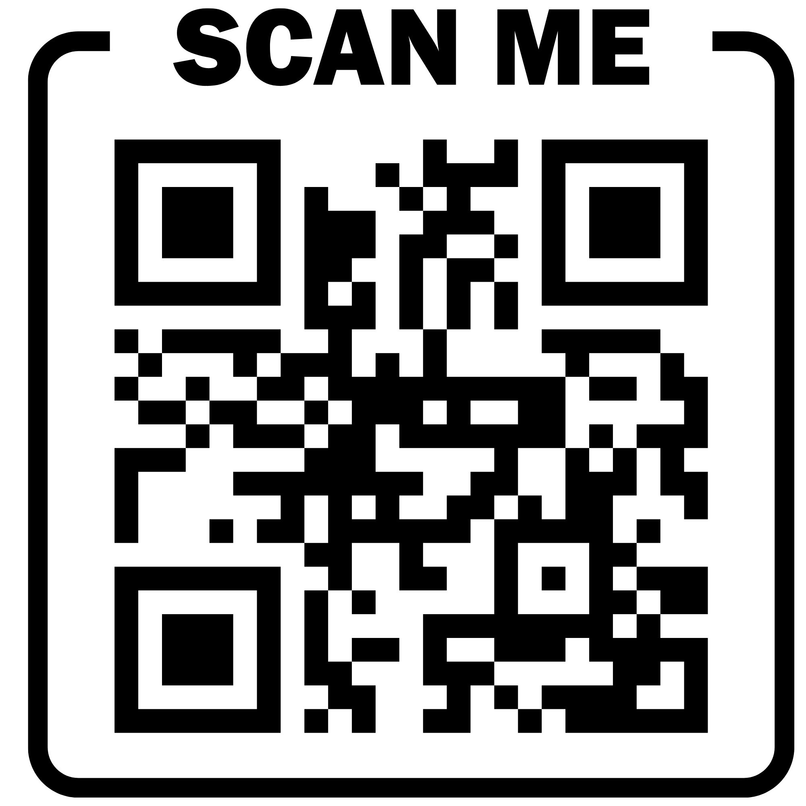

MS CS | MS EE | BS EE
Webiste: [https://bekcsys.com/about/](https://bekcsys.com/) 

Webiste QR Code : 

 

## 💻 What I do  :
- Pretty much everything : WebApps, Data Engineering, CI/CD, Dashboarding, Real time Monitoring /Observability 
- PLC and controller programming

## 🏅 Certs

   
  

